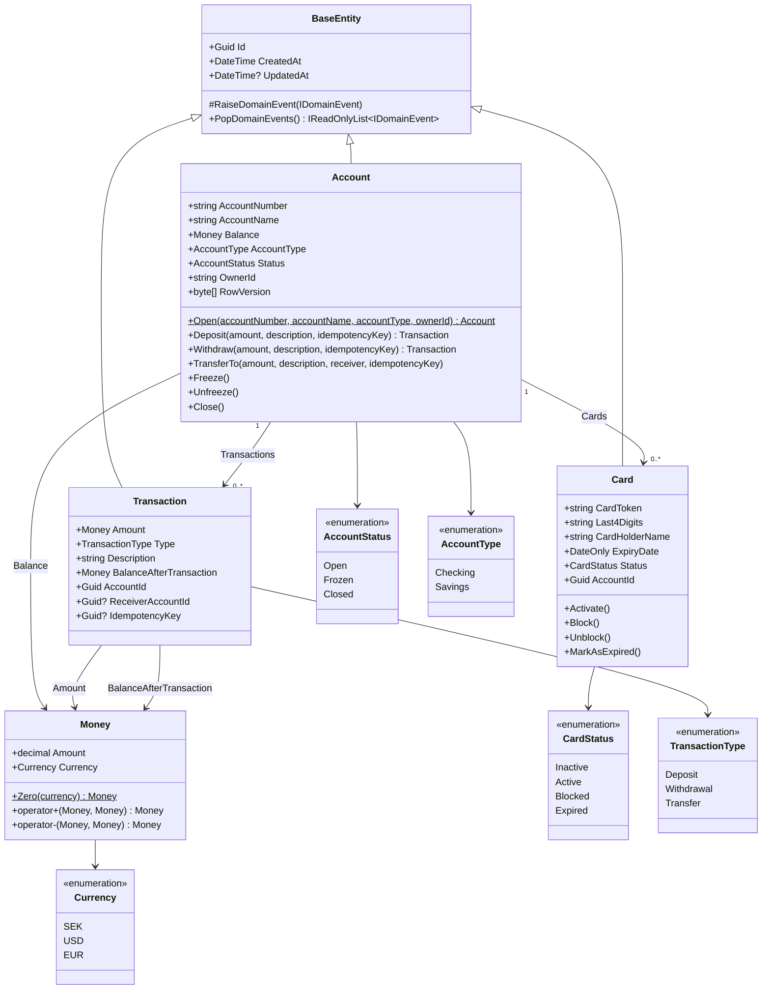

# NexaPay – Domändiagram

```mermaid
classDiagram
    direction TB

    class BaseEntity {
        +Guid Id
        +DateTime CreatedAt
        +DateTime? UpdatedAt
        #RaiseDomainEvent(IDomainEvent)
        +PopDomainEvents() IReadOnlyList~IDomainEvent~
    }

    class Account {
        +string AccountNumber
        +string AccountName
        +Money Balance
        +AccountType AccountType
        +AccountStatus Status
        +string OwnerId
        +byte[] RowVersion
        +Open(accountNumber, accountName, accountType, ownerId) Account$
        +Deposit(amount, description, idempotencyKey) Transaction
        +Withdraw(amount, description, idempotencyKey) Transaction
        +TransferTo(amount, description, receiver, idempotencyKey)
        +Freeze()
        +Unfreeze()
        +Close()
    }

    class Card {
        +string CardToken
        +string Last4Digits
        +string CardHolderName
        +DateOnly ExpiryDate
        +CardStatus Status
        +Guid AccountId
        +Activate()
        +Block()
        +Unblock()
        +MarkAsExpired()
    }

    class Transaction {
        +Money Amount
        +TransactionType Type
        +string Description
        +Money BalanceAfterTransaction
        +Guid AccountId
        +Guid? ReceiverAccountId
        +Guid? IdempotencyKey
    }

    class Money {
        +decimal Amount
        +Currency Currency
        +Zero(currency) Money$
        +operator+(Money, Money) Money
        +operator-(Money, Money) Money
    }

    class AccountStatus {
        <<enumeration>>
        Open
        Frozen
        Closed
    }

    class AccountType {
        <<enumeration>>
        Checking
        Savings
    }

    class CardStatus {
        <<enumeration>>
        Inactive
        Active
        Blocked
        Expired
    }

    class TransactionType {
        <<enumeration>>
        Deposit
        Withdrawal
        Transfer
    }

    class Currency {
        <<enumeration>>
        SEK
        USD
        EUR
    }

    BaseEntity <|-- Account
    BaseEntity <|-- Card
    BaseEntity <|-- Transaction

    Account "1" --> "0..*" Card : Cards
    Account "1" --> "0..*" Transaction : Transactions
    Account --> Money : Balance
    Transaction --> Money : Amount
    Transaction --> Money : BalanceAfterTransaction

    Account --> AccountStatus
    Account --> AccountType
    Card --> CardStatus
    Transaction --> TransactionType
    Money --> Currency
```
