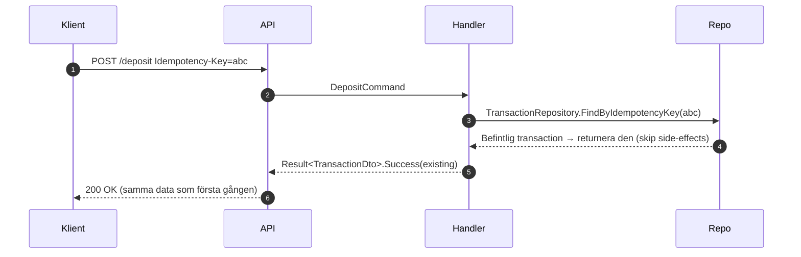
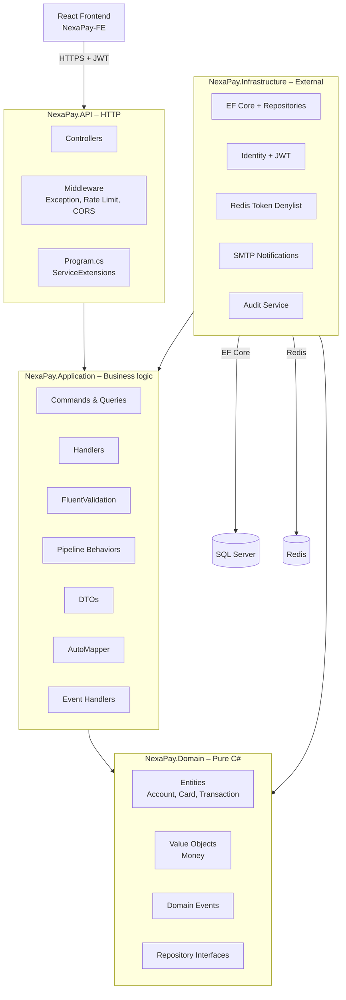

# NexaPay – User Flow & Data Flow

Detta dokument beskriver hur **användare** rör sig genom NexaPay (User Flow) och hur **data** flyter genom systemets lager (Data Flow). Tillsammans med `DOMAIN_DIAGRAM.md` (UML Class Diagram) ger det en komplett bild av systemet.

---

## 1. User Flow – Komplett kundresa

Visar vägen från registrering till en genomförd överföring för en vanlig användare (rollen `User`).

```mermaid
flowchart TD
    Start([Användare öppnar appen]) --> HasAccount{Har konto?}

    HasAccount -- Nej --> Register[Registrera<br/>POST /api/auth/register]
    Register --> EmailSent[E-postbekräftelse skickas]
    EmailSent --> ConfirmEmail[Klicka länk<br/>POST /api/auth/confirm-email]
    ConfirmEmail --> Login

    HasAccount -- Ja --> Login[Logga in<br/>POST /api/auth/login]
    Login --> LoginOK{Lyckas?}
    LoginOK -- Nej --> ForgotPwd[Glömt lösenord<br/>POST /api/auth/forgot-password]
    ForgotPwd --> ResetPwd[Återställ lösenord<br/>POST /api/auth/reset-password]
    ResetPwd --> Login

    LoginOK -- Ja --> Dashboard[Översikt<br/>GET /api/accounts]
    Dashboard --> Action{Vad vill användaren?}

    Action -- Skapa konto --> CreateAcc[POST /api/accounts]
    CreateAcc --> Dashboard

    Action -- Se konto --> AccDetail[GET /api/accounts/&#123;id&#125;<br/>GET /api/transactions/account/&#123;id&#125;<br/>GET /api/cards/account/&#123;id&#125;]
    AccDetail --> AccAction{Åtgärd?}

    AccAction -- Insättning --> Deposit[POST /api/transactions/deposit]
    AccAction -- Uttag --> Withdraw[POST /api/transactions/withdraw]
    AccAction -- Skapa kort --> CreateCard[POST /api/cards]
    AccAction -- Stäng konto --> CloseAcc[DELETE /api/accounts/&#123;id&#125;]
    Deposit --> Dashboard
    Withdraw --> Dashboard
    CreateCard --> Dashboard
    CloseAcc --> Dashboard

    Action -- Överföring --> TransferPage[Överförings-sidan]
    TransferPage --> Lookup[GET /api/accounts/lookup<br/>?number=&hellip;]
    Lookup --> LookupOK{Hittades?}
    LookupOK -- Nej --> TransferPage
    LookupOK -- Ja --> Transfer[POST /api/transactions/transfer]
    Transfer --> Dashboard

    Action -- Betala faktura --> Invoice[POST /api/transactions/invoice-payment]
    Invoice --> Dashboard

    Action -- Logga ut --> Logout[POST /api/auth/logout]
    Logout --> End([JWT revokeras<br/>användare till login])
```



### Personalflöden

Bankpersonal (Admin, BankManager, Teller, Auditor) har ytterligare möjligheter:

```mermaid
flowchart LR
    StaffLogin[Personal loggar in] --> StaffDash[Ser ALLA konton]
    StaffDash --> StaffAction{Roll-baserad åtgärd}

    StaffAction -- Admin --> AdminPanel[/admin: skapa personalanvändare<br/>POST /api/admin/users]
    StaffAction -- Admin/BankManager --> BlockCard[Blockera/avblockera kort<br/>PUT /api/cards/&#123;id&#125;/block]
    StaffAction -- Admin/BankManager/Teller --> Freeze[Frysa/avfrysa konto<br/>PUT /api/accounts/&#123;id&#125;/freeze]
    StaffAction -- Auditor --> ReadOnly[Endast läsa – inga skrivåtgärder]
```

---

## 2. Data Flow – En request genom alla lager

Visar exakt hur data flyter när en användare gör en **insättning** (`POST /api/transactions/deposit`). Samma mönster gäller för alla commands.

```mermaid
sequenceDiagram
    autonumber
    actor User as Användare<br/>(React-frontend)
    participant API as TransactionsController<br/>(NexaPay.API)
    participant Auth as JWT Middleware
    participant Mediator as IMediator<br/>(MediatR)
    participant Log as LoggingBehavior
    participant Val as ValidationBehavior<br/>(FluentValidation)
    participant Retry as ConcurrencyRetryBehavior
    participant Audit as AuditBehavior
    participant Handler as DepositHandler<br/>(NexaPay.Application)
    participant Repo as IAccountRepository
    participant UoW as IUnitOfWork
    participant Domain as Account<br/>(NexaPay.Domain)
    participant EF as EF Core
    participant DB as SQL Server
    participant Pub as IPublisher
    participant EvtH as MoneyDepositedHandler

    User->>API: POST /api/transactions/deposit<br/>Bearer JWT + body + Idempotency-Key
    API->>Auth: Validera JWT-token
    Auth-->>API: ClaimsPrincipal (sub, role, jti)
    API->>API: [Authorize(Roles=CanWrite)]<br/>+ [EnableRateLimiting("financial")]
    API->>Mediator: Send(DepositCommand)

    Mediator->>Log: 1. Logga "Handling DepositCommand"
    Log->>Val: 2. Kör DepositCommandValidator
    Val-->>Log: Valid eller Failure(errors)
    Val->>Retry: 3. Anropa nästa (försök upp till 3 ggr)
    Retry->>Audit: 4. Förbereder audit
    Audit->>Handler: Anropa handler

    Handler->>Repo: GetByIdAsync(accountId)
    Repo->>EF: DbSet.FindAsync
    EF->>DB: SELECT * FROM Accounts WHERE Id=@p
    DB-->>EF: Account-rad
    EF-->>Repo: Account-entitet (tracked)
    Repo-->>Handler: Account

    Handler->>Handler: Verifiera ownership eller IsStaff
    Handler->>Domain: account.Deposit(money, description, idempotencyKey)
    Domain->>Domain: Guard: Status == Open<br/>Balance += amount<br/>RaiseDomainEvent(MoneyDeposited)
    Domain-->>Handler: Transaction (ny entitet)

    Handler->>UoW: SaveChangesAsync()
    UoW->>EF: SaveChangesAsync()
    EF->>DB: BEGIN TRAN<br/>UPDATE Accounts SET Balance=&hellip;, RowVersion=&hellip;<br/>INSERT INTO Transactions &hellip;<br/>COMMIT
    DB-->>EF: rows affected
    EF-->>UoW: OK

    UoW->>Pub: Publish(MoneyDeposited)
    Pub->>EvtH: MoneyDepositedHandler.Handle
    EvtH-->>Pub: Loggar / skickar notification
    UoW-->>Handler: Klart

    Handler-->>Audit: Result<TransactionDto>.Success
    Audit->>Audit: 5. Skriv audit-rad till AuditLog
    Audit-->>Retry: Result
    Retry-->>Val: Result
    Val-->>Log: Result
    Log->>Log: 6. Logga elapsed-time (warning om >500ms)
    Log-->>Mediator: Result
    Mediator-->>API: Result<TransactionDto>

    API->>API: result.IsSuccess<br/>→ Ok(ApiResponse.Ok(value, "Insättning &hellip;"))
    API-->>User: 200 OK<br/>&#123; success: true, data: &#123; &hellip; &#125; &#125;
```

### Vad varje steg gör

1. **Klient → API** – Axios skickar HTTPS-request med JWT i `Authorization`-headern och en `Idempotency-Key` i en separat header.
2. **JWT-middleware** – Validerar signaturen (HS256), kontrollerar `iss`, `aud`, `exp`, och slår upp `jti` i token-denylisten (Redis eller in-memory).
3. **Rate limiting** – `[EnableRateLimiting("financial")]` slår mot fixed-window-bucket per IP. Avvisar med 429 vid överskridning.
4. **Authorization** – `[Authorize(Roles = Roles.CanWrite)]` släpper bara igenom Admin/BankManager/Teller/User.
5. **MediatR-pipeline** – Fyra behaviors körs i ordning: Logging → Validation → ConcurrencyRetry → Audit → Handler.
6. **Validering** – `DepositCommandValidator` kontrollerar `AccountId`, `Amount > 0` och daglig max-gräns.
7. **Handler** – Hämtar Account från repository, verifierar ägarskap, anropar `account.Deposit()` på domänen.
8. **Domain** – `Account.Deposit()` enforcear att status är `Open`, höjer Balance, raisar `MoneyDeposited`-event.
9. **UnitOfWork** – Kör `SaveChangesAsync()` i en transaktion, sedan dispatchar domain events via `IPublisher`.
10. **Event-handlers** – `MoneyDepositedHandler` reagerar (loggar, skickar notification om SMTP är konfigurerat).
11. **Audit** – `AuditBehavior` skriver en rad till `AuditLog`-tabellen efter att handlern lyckats.
12. **Response** – Controller wrappar `Result<T>` i `ApiResponse` och returnerar JSON med status 200.

### Idempotency-flödet

Om klienten skickar samma `Idempotency-Key` två gånger:



Detta säkerställs av en *filtered unique index* på `Transactions.IdempotencyKey` (bara icke-null-värden indexeras) – ett databas-constraint som omöjliggör dubbletter även vid race-conditions.

---

## 3. Auth Data Flow – Login + skyddat anrop

Visar vad som händer mellan login och ett efterföljande skyddat anrop.

```mermaid
sequenceDiagram
    autonumber
    actor User as Användare
    participant FE as React-frontend
    participant API as NexaPay.API
    participant Identity as ASP.NET Identity
    participant JWT as JwtService
    participant DB as SQL Server
    participant Cache as Token Denylist<br/>(Redis / InMemory)

    Note over User,Cache: 1. Login
    User->>FE: Anger e-post + lösenord
    FE->>API: POST /api/auth/login &#123; email, password &#125;
    API->>Identity: UserManager.CheckPasswordAsync
    Identity->>DB: SELECT * FROM AspNetUsers WHERE Email=&hellip;
    DB-->>Identity: User-rad
    Identity-->>API: OK / lockout
    API->>JWT: GenerateToken(user, role)
    JWT-->>API: HS256-token (sub, email, role, jti, exp)
    API-->>FE: 200 &#123; token, email, role, expiresAt &#125;
    FE->>FE: localStorage.setItem('nexapay_user', &hellip;)

    Note over User,Cache: 2. Skyddat anrop
    User->>FE: Klickar "Mina konton"
    FE->>FE: Axios interceptor lägger på<br/>Authorization: Bearer &lt;token&gt;
    FE->>API: GET /api/accounts (Bearer)
    API->>API: JwtBearerHandler validerar signatur, iss, aud, exp
    API->>Cache: IsRevoked(jti)?
    Cache-->>API: Nej
    API->>API: ClaimsPrincipal: sub, email, role
    API->>API: AccountsController.GetAll → MediatR
    API-->>FE: 200 &#123; data: [&hellip;] &#125;

    Note over User,Cache: 3. Logout
    User->>FE: Klickar "Logga ut"
    FE->>API: POST /api/auth/logout (Bearer)
    API->>Cache: Revoke(jti, expiry)
    API-->>FE: 200 OK
    FE->>FE: localStorage.removeItem('nexapay_user')

    Note over User,Cache: 4. Försök återanvända samma token
    FE->>API: GET /api/accounts (Bearer samma token)
    API->>Cache: IsRevoked(jti)? → Ja
    API-->>FE: 401 Unauthorized
```

---

## 4. Domain Event Flow

Domain events publiceras **efter** att databasen har sparat – aldrig om transaktionen failar.

```mermaid
flowchart LR
    Handler[Handler<br/>account.Deposit&#40;...&#41;] --> RaiseEv[Domain:<br/>RaiseDomainEvent&#40;MoneyDeposited&#41;]
    RaiseEv --> SaveDb[(UnitOfWork.SaveChangesAsync)]
    SaveDb --> CommitOK{DB-commit OK?}
    CommitOK -- Nej --> Throw[Throw – inga events publiceras]
    CommitOK -- Ja --> Collect[Samla alla DomainEvents<br/>från ChangeTracker]
    Collect --> Publish[IPublisher.Publish&#40;event&#41;]
    Publish --> H1[MoneyDepositedHandler]
    Publish --> H2[MoneyWithdrawnHandler]
    Publish --> H3[CardBlockedHandler]
    Publish --> Hn[&hellip; etc]
    H1 --> Side1[Loggar / notification]
    H2 --> Side2[Loggar / notification]
    H3 --> Side3[Loggar / notification]
    Hn --> Sideb[Loggar / notification]
    Side1 --> Clear[entity.PopDomainEvents&#40;&#41;<br/>rensar listan]
```



Detta mönster gör att side-effects (mejl, webhooks, externa system) bara körs när databasen är konsistent.

---

## 5. Lager-översikt – var koden lever



Beroenderiktningen pekar alltid **inåt** – Domain har inga externa NuGet-beroenden, Application bara på Domain, Infrastructure implementerar interfaces definierade i Application/Domain.

---

## Relaterade dokument

- **`README.md`** – Översikt, tech stack, getting started
- **`DOMAIN_DIAGRAM.md`** – UML Class Diagram över domänlagret
- **`APPLICATION_GUIDE.md`** – Detaljerad guide till Application-lagret
- **`ARCHITECTURE_REVIEW.md`** – Designbeslut och motivering
- **`CODEBASE_GUIDE.md`** – Filöversikt och konventioner
